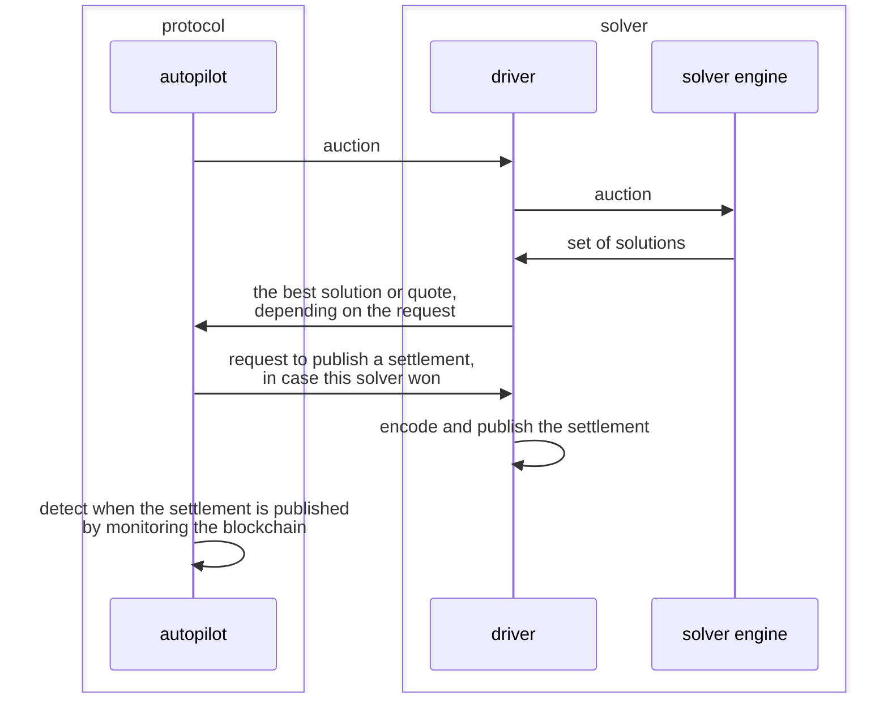

# Driver

The purpose of the driver is to make it easier to author, run, and maintain solvers.

All solvers do the following:

- collect some onchain liquidity (optional),
- pick the best solution from a set,
- encode the solution into a settlement and publish it when it wins the competition,
- generate quotes.

The logic for these tasks is, in many (almost all) cases, completely reusable. The only piece of logic that is
unique to an individual solver is how to generate a set of solutions. Then, picking the best solution,
or converting the solutions into a quote, or encoding and publishing settlements, etc. can all be done
in the same way.

The purpose of the driver is to execute all of the tasks above so that the solvers don't have to. Then,
the solvers need only write the code for generating solutions.

Solvers which make use of the driver are sometimes referred to as _solver engines_, whereas the
$(solver \space engine, driver)$ pair is referred to as _the solver_. A solver which does not make
use of the driver is sometimes referred to as a _full solver_. But often the distinction between
a solver which uses the driver and one which does not use the driver is irrelevant, in which case
we often simply say _solver_.

Note that all of the functionality which is normally provided by the driver has to be provided by
the full solver itself, in case it decides not to use the driver.

## Sequence Diagram

