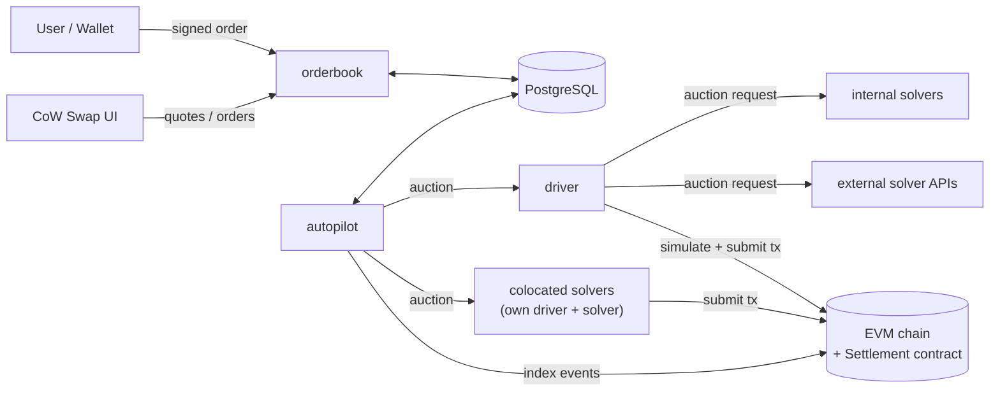
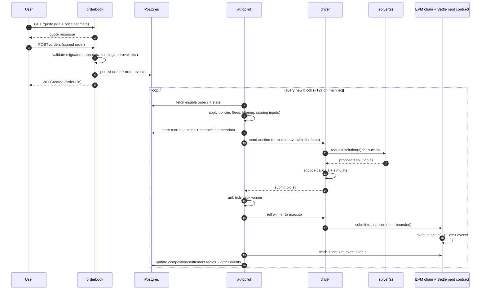
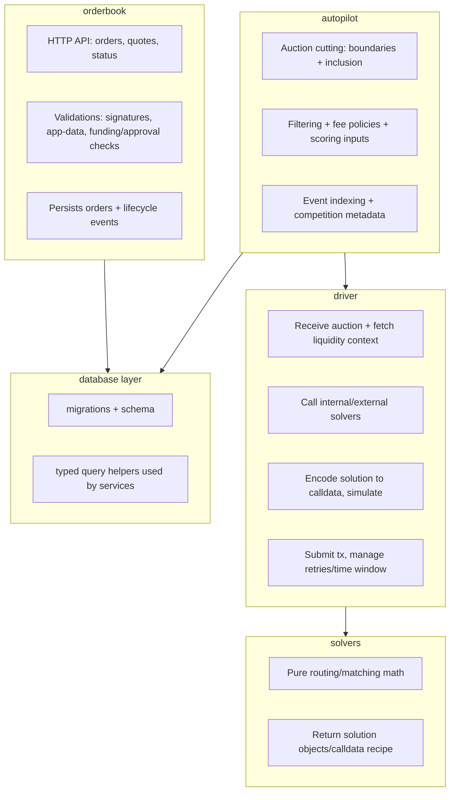
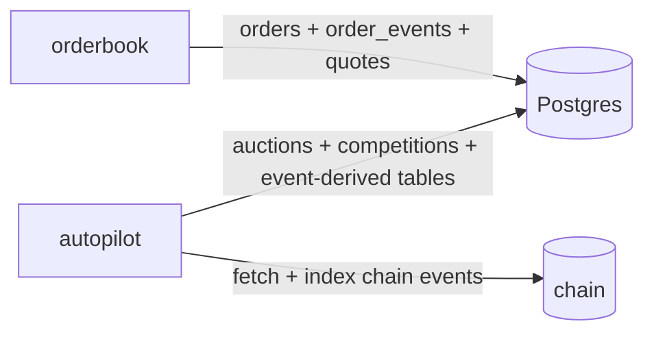

# Onboarding: CoW Protocol Services (this repo)

This repository is a Rust workspace containing the core backend services that run the CoW Protocol off-chain system:

- Users submit **signed orders** to the **orderbook**
- **autopilot** periodically creates **auctions** and sends them to **drivers**
- Each **driver** calls its **solver(s)** for solutions, then simulates + submits the winner to the on-chain **Settlement** contract

For local end-to-end development, use the playground stack. See `playground/README.md`.

## System context (big picture)



## Core "happy path" flow (order → auction → settlement)



## Solver types

- **Colocated**: External partners run their own driver + solver. Autopilot sends them the auction and they submit solutions independently. Full control, full responsibility.
- **Non-colocated**: We run the driver, configured with their solver API endpoint. We handle simulation and submission on their behalf.

## Responsibilities by service (what to touch for what change)



## Key crates (where shared logic lives)

- `crates/shared`: common utilities (order quoting/validation, fee logic, external prices, argument parsing)
- `crates/price-estimation`: price estimation strategies (onchain, trade-based, native)
- `crates/gas-price-estimation`: gas price estimation
- `crates/database`: schema + DB helpers used by `orderbook` and `autopilot`
- `crates/model`: API/data model types used across services
- `crates/contracts`: Alloy-based contract bindings for on-chain interaction
- `crates/ethrpc` + `crates/chain`: Ethereum RPC / chain interaction helpers
- `crates/observe`: logging/metrics initialization helpers
- `crates/app-data`: order app-data validation

## Where to start reading code (practical entrypoints)

Each service follows the same pattern: `main.rs` just sets up the allocator and calls `start()`, which lives in `run.rs`. The `run.rs` file parses CLI arguments, initializes logging/metrics, connects to the database and/or chain, and wires up the service components.

- **Orderbook (HTTP API + order validation)**
  - Start here: `crates/orderbook/src/run.rs` (initialization + service wiring)
  - Typical changes: API endpoints, order validation, quoting, DB writes

- **Autopilot (auction creation + policies + event indexing)**
  - Start here: `crates/autopilot/src/run.rs`
  - Typical changes: auction filtering/inclusion, fee policies, competition persistence, chain event indexing

- **Driver (simulation + settlement submission + solver integration)**
  - Start here: `crates/driver/README.md` for context, then `crates/driver/src/run.rs`
  - Typical changes: solver API integration, encoding/calldata, simulation logic, submission strategy

- **Solvers (internal solver engines)**
  - Start here: `crates/solvers/src/run.rs`
  - Typical changes: routing/matching math, solution generation

- **On-chain bindings**
  - Start here: `crates/contracts/README.md`
  - Typical changes: adding new contract artifacts/bindings, updating ABIs, exposing bindings in `lib.rs`

- **Database schema + migrations**
  - Start here: `database/README.md` (schema overview) and `crates/database` (query code)

- **End-to-end tests**
  - Start here: `crates/e2e/tests/e2e/` (individual test scenarios) and `crates/e2e/src/setup/` (test harness)
  - The e2e crate spins up a local Anvil node (optionally forking mainnet/Gnosis), deploys contracts, starts services (orderbook, autopilot, driver, solver), and runs full order→settlement flows
  - Tests are split into `local_node` (clean chain) and `forked_node` (forking a real network via `FORK_URL_MAINNET` / `FORK_URL_GNOSIS`)
  - Run local e2e tests: `cargo nextest run -p e2e local_node --test-threads 1 --failure-output final --run-ignored ignored-only`
  - Run forked e2e tests: `cargo nextest run -p e2e forked_node --test-threads 1 --run-ignored ignored-only --failure-output final`

## Local development (recommended path)

### Run the full stack (best for onboarding)

See `playground/README.md`. The short version is:

```bash
docker compose -f playground/docker-compose.fork.yml up --build
```

You'll need to set `ETH_RPC_URL` in `playground/.env` first (an Ethereum RPC endpoint for anvil to fork from). This starts a forked chain + Postgres + services + UI/Explorer components with live-reload behavior.

### Fast local compile / test loop (without running the stack)

- **Check**:

```bash
cargo check --workspace --all-targets
```

- **Unit tests (CI-compatible runner)**:

```bash
cargo nextest run
```

### Formatting and linting

This repo formats Rust code with nightly rustfmt (and TOML with Tombi). See `README.md` for the `just` commands.

## Database mental model (what’s in Postgres)

The DB stores orders, auctions, competitions, and indexed on-chain events.

- For a guided schema overview, see `database/README.md`.



## Debugging "why didn’t my order trade"?

When you need to investigate an order lifecycle end-to-end (API → DB → logs → auction inclusion → solver bids → settlement),
see [`COW_ORDER_DEBUG_SKILL.md`](./COW_ORDER_DEBUG_SKILL.md).
