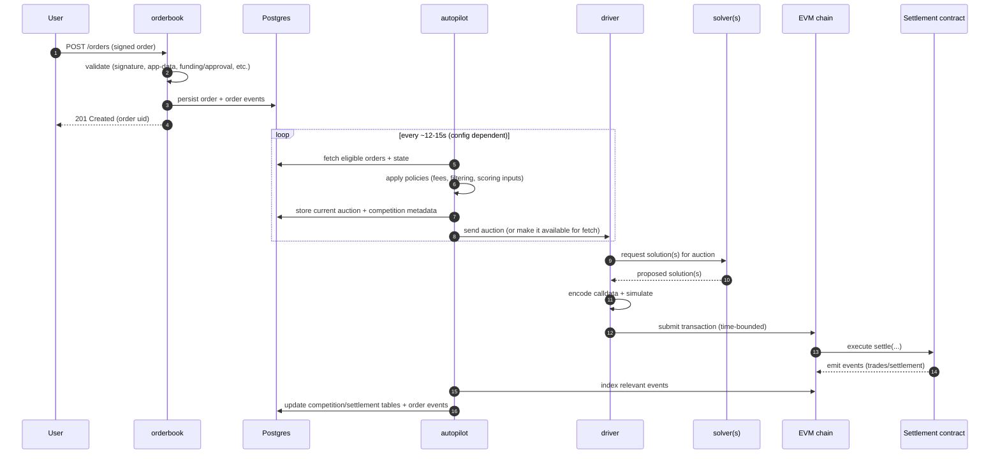
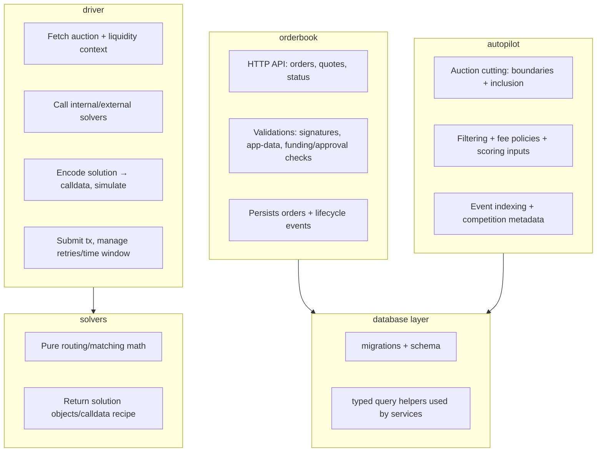

# Onboarding: CoW Protocol Services (this repo)

This repository is a Rust workspace containing the core backend services that run the CoW Protocol off-chain system:

- Users submit **signed orders** to the **orderbook**
- **autopilot** periodically creates **auctions**
- **solvers** propose **solutions**
- **driver** simulates + submits the winning solution to the on-chain **Settlement** contract

For local end-to-end development, use the playground stack. See `playground/README.md`.

---

## System context (big picture)

```mermaid
flowchart LR
  U[User / Wallet] -->|signed order| OB[orderbook (HTTP API)]
  UI[CoW Swap UI] -->|quotes / orders| OB
  OB <--> DB[(PostgreSQL)]
  AP[autopilot] <--> DB
  AP -->|auction| DR[driver]

  subgraph Solving
    DR -->|auction request| IS[internal solver(s)]
    DR -->|auction request| ES[external solver API(s)]
  end

  DR -->|simulate + submit tx| CH[(EVM chain)]
  CH --> SC[Settlement contract]
  CH -->|events| AP
  AP -->|observability/alerts| OBS[logs + metrics]
  OB --> OBS
  DR --> OBS
```

---

## Core “happy path” flow (order → auction → settlement)



---

## Responsibilities by service (what to touch for what change)



---

## Key crates (where shared logic lives)

- `crates/shared`: common utilities (pricing, gas estimation helpers, liquidity glue)
- `crates/database`: schema + DB helpers used by `orderbook` and `autopilot`
- `crates/model`: API/data model types used across services
- `crates/contracts`: Alloy-based contract bindings for on-chain interaction
- `crates/ethrpc` + `crates/chain`: Ethereum RPC / chain interaction helpers
- `crates/observe`: logging/metrics initialization helpers
- `crates/app-data`: order app-data validation (notably size limits; default 8KB)

---

## Where to start reading code (practical entrypoints)

- **Orderbook (HTTP API + order validation)**
  - Start here: `crates/orderbook/src/main.rs` (binary entrypoint) → `crates/orderbook/src/lib.rs` (service wiring)
  - Typical changes: API endpoints, order validation, quoting, DB writes

- **Autopilot (auction creation + policies + event indexing)**
  - Start here: `crates/autopilot/src/main.rs` → `crates/autopilot/src/lib.rs`
  - Typical changes: auction filtering/inclusion, fee policies, competition persistence, chain event indexing

- **Driver (simulation + settlement submission + solver integration)**
  - Start here: `crates/driver/README.md`
  - Binary entrypoint: `crates/driver/src/main.rs` → `crates/driver/src/lib.rs`
  - Typical changes: solver API integration, encoding/calldata, simulation logic, submission strategy

- **Solvers (internal solver engines)**
  - Start here: `crates/solvers/src/main.rs` → `crates/solvers/src/lib.rs`
  - Typical changes: routing/matching math, solution generation

- **On-chain bindings**
  - Start here: `crates/contracts/README.md`
  - Typical changes: adding new contract artifacts/bindings, updating ABIs, exposing bindings in `lib.rs`

- **Database schema + migrations**
  - Start here: `database/README.md` (schema overview) and `crates/database` (query code)

---

## Local development (recommended path)

### Run the full stack (best for onboarding)

See `playground/README.md`. The short version is:

```bash
docker compose -f playground/docker-compose.fork.yml up --build
```

This starts a forked chain + Postgres + services + UI/Explorer components with live-reload behavior.

### Fast local compile / test loop (without running the stack)

- **Check**:

```bash
cargo check --workspace --all-targets
```

- **Unit tests (CI-compatible runner)**:

```bash
cargo nextest run
```

### Formatting and linting

This repo formats Rust code with nightly rustfmt (and TOML with Tombi). See `README.md` for the `just` commands.

---

## Database mental model (what’s in Postgres)

The DB stores orders, auctions, competitions, and indexed on-chain events.

- For a guided schema overview, see `database/README.md`.

```mermaid
flowchart LR
  OB[orderbook] -->|orders + order_events + quotes| DB[(Postgres)]
  AP[autopilot] -->|auctions + competitions + event-derived tables| DB
  AP -->|index chain events (with delay)| CH[(chain)]
  CH -->|Settlement/Trade events| AP
```

---

## Debugging “why didn’t my order trade?”

When you need to investigate an order lifecycle end-to-end (API → DB → logs → auction inclusion → solver bids → settlement),
follow `docs/COW_ORDER_DEBUG_SKILL.md`.

